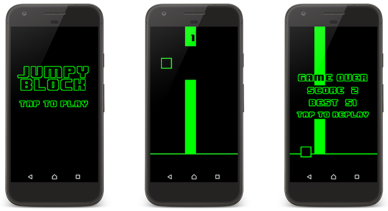

# JumpyBlock
This is a Flappy Bird clone written using libGDX

## Screenshot


## Running the project

### Running the desktop project
```
./gradlew desktop:run
```
This compiles the core and desktop project, and runs the desktop starter.

### Running the Android project
```
./gradlew android:installDebug android:run
```
This task will create a debug APK of the application, install it on the first connected emulator or device and start the main activity.

## Useful Links
Resources useful for the completion of this project:

* [libGDX](https://libgdx.badlogicgames.com/) (cross-platform game development framework)
* [Gradle](https://gradle.org) (for building and dependency management)
* [Music](http://ericskiff.com/music/) (the track used in the game is A Night Of Dizzy Spells by Eric Skiff)
* [Font](http://www.dafont.com/8bit-wonder.font) (the font used in the game is 8-bit Wonder created by Joiro Hatagaya)
